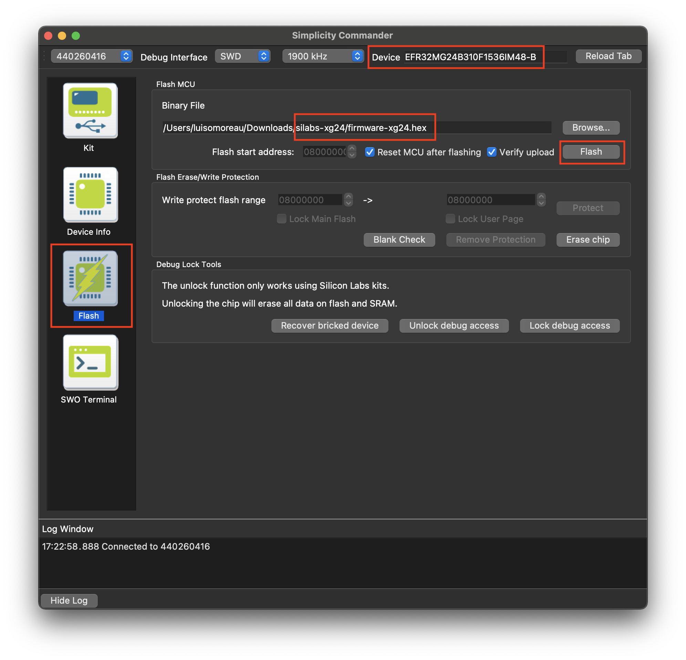
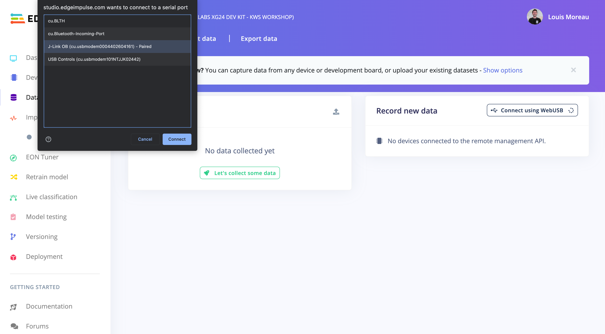
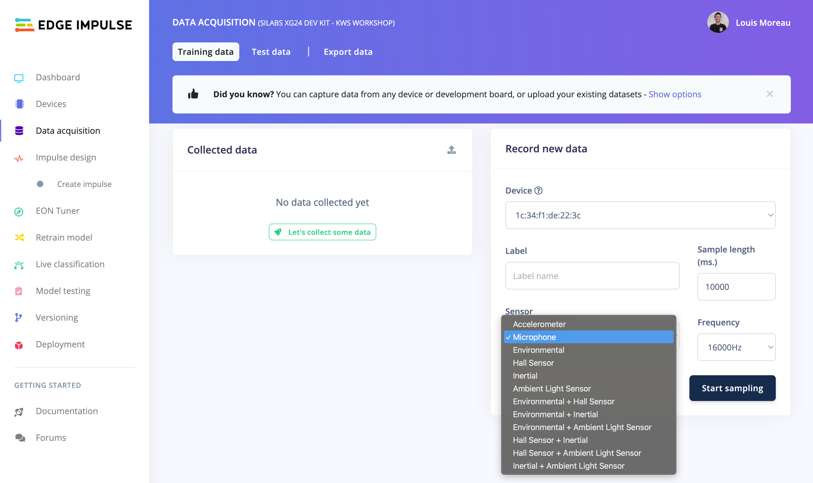
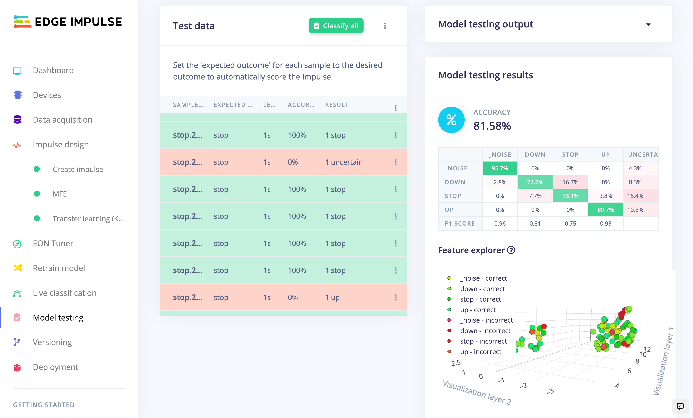

# Workshop using SiLabs xG24 Dev Kit

* **Objectives:** Build a keyword recognition application from scratch by collecting data from the embedded sensors, training and validating your machine learning pipeline using Edge Impulse Studio, and, deploying the custom model back to your device.
* **Duration:** ~90 min

## Workshop Agenda

1. **Introduction**

2. **Setup local environment**

* Install dependencies
* Flash default Edge Impulse firmware

3. **Build your machine learning pipeline**

* Collect data
* Create an Impulse
* Preprocess your data
* Train your machine learning model
* Validate your model

 1. **Run the inference on the xG24 Dev Kit**

* Using Edge Impulse ready-to-go firmware
* Using Simplicity Studio 5 to add you business logic

# Hardware overview

The Silicon Labs xG24 Dev Kit (xG24-DK2601B) is a compact, feature-packed development platform built for the EFR32MG24 Cortex-M33 microcontroller. It provides the fastest path to develop and prototype wireless IoT products. This development platform supports up to +10 dBm output power and includes support for the 20-bit ADC as well as the xG24's AI/ML hardware accelerator. The platform also features a wide variety of sensors, a microphone, Bluetooth Low Energy and a battery holder - and it's fully supported by Edge Impulse! You'll be able to sample raw data as well as build and deploy trained machine learning models directly from the Edge Impulse Studio - and even stream your machine learning results over BLE to a phone.

The Edge Impulse firmware for this development board is open source and hosted on GitHub: [edgeimpulse/firmware-silabs-xg24](https://github.com/edgeimpulse/firmware-silabs-xg24).


# Setup local environment

## Install dependencies

To set this device up with Edge Impulse, you will need to install the following software:
1. [Simplicity Studio 5](https://www.silabs.com/developers/simplicity-studio)
1. [Simplicity Commander](https://community.silabs.com/s/article/simplicity-commander). A command line program we will use to flash firmware images onto the target.
1. The [Edge Impulse CLI](https://docs.edgeimpulse.com/docs/edge-impulse-cli/cli-installation) which will enable you to connect your xG24 Dev Kit directly to Edge Impulse Studio, so that you can collect raw data and trigger in-system inferences.

> Problems installing the CLI?
> 
> See the [Installation and troubleshooting](https://docs.edgeimpulse.com/docs/edge-impulse-cli/cli-installation) guide.

### Updating the firmware

Edge Impulse Studio can collect data directly from your xG24 Dev Kit and also help you trigger in-system inferences to debug your model, but in order to allow Edge Impulse Studio to interact with your xG24 Dev Kit you first need to flash it with our base firmware image.

### 1. Download the base firmware image

[Download the latest Edge Impulse firmware](https://cdn.edgeimpulse.com/firmware/silabs-xg24.zip), and unzip the file. Once downloaded, unzip it to obtain the `firmware-xg24.hex` file, which we will be using in the following steps.

### 2. Connect the xG24 Dev Kit to your computer

Use a micro-USB cable to connect the xG24 Dev Kit to your development computer (where you downloaded and installed [Simplicity Commander](https://community.silabs.com/s/article/simplicity-commander)).


### 3. Load the base firmware image with Simplicity Commander

You can use [Simplicity Commander](https://community.silabs.com/s/article/simplicity-commander) to flash your xG24 Dev Kit with our [base firmware image](https://cdn.edgeimpulse.com/firmware/silabs-xg24.zip). To do this, first select your board from the dropdown list on the top left corner:


Then go to the "Flash" section on the left sidebar, and select the base firmware image file you downloaded in the first step above (i.e., the file named `firmware-xg24.hex`). You can now press the `Flash` button to load the base firmware image onto the xG24 Dev Kit.



*Note that on some Operating Systems, you need to press the **reset** button on the board to load the firmware. To make sure the board is flashed with Edge Impulse default firmware, the board will then turn on and off the color leds blue/green/red/blue/green/red/blue/green for 2 seconds*

## Connecting to Edge Impulse

With all the software in place, it's time to connect the xG24 Dev Kit to Edge Impulse.

### 1. Connect the development board to your computer

Use a micro-USB cable to connect the development board to your computer.

### 2. Setting keys

From a command prompt or terminal, run:

```
edge-impulse-daemon
```

This will start a wizard which will ask you to log in, and choose an Edge Impulse project. If you want to switch projects run the command with `--clean`.

Alternatively, recent versions of Google Chrome and Microsoft Edge can collect data directly from your development board, without the need for the Edge Impulse CLI. See [this blog post](https://www.edgeimpulse.com/blog/collect-sensor-data-straight-from-your-web-browser) for more information.

### 3. Verifying that the device is connected

That's all! Your device is now connected to Edge Impulse. To verify this, go to [your Edge Impulse project](https://studio.edgeimpulse.com/studio/select-project?autoredirect=1), and click **Devices** on the left sidebar. The device will be listed there:


# Build your machine learning pipeline

If you do not have an Edge Impulse account yet, start by creating an account on Edge Impulse Studio and create a project.

On this new project, select the `SiLabs EFR32MG24` board so the latency and performance estimations will calculated for your microcontroller:


## Collect data from the device

> If you are having any troubles while collecting data on your Edge Impulse project, the project we are building together is public. You can clone it on your Edge Impulse account and get started from there: [https://studio.edgeimpulse.com/public/106465/latest](https://studio.edgeimpulse.com/public/106465/latest)

To start collecting some data, go to the Data acquisition view and click on the **Connect using WebUSB** button on the upper right corner:



And select **Microphone** from the sensor list:



Set your label and click on **Start sampling**.

Once you long sample (20s) has been collected, you can extract the keywords by clicking on **⋮** and selecting **Split samples**:


.

This will create 1 second-long samples containing your keyword.

**Repeat this step until you have around 2/3 minutes of data per class**

## Create an Impulse

After collecting data for your project, you can now create your Impulse. A complete Impulse will consist of 3 main building blocks: input block, processing block and a learning block.

**Here you will define your own machine learning pipeline.**

In the video tutorial, we will test two different pipelines to see which provides the best accuracy.

Below is the one with the best accuracy but is also bigger in size, if you want to integrate your impulse with an application that uses a lot of resources on the SiLabs xG24, you might want to use a **NN Classifier** instead of the **Transfer Learning (Keyword Spotting)** learning block.


Click on **Save** and navigate to the **MFE** tab.

## Preprocess your data

Extracting meaningful features from your data is crucial to building small and reliable machine learning models, and in Edge Impulse this is done through processing blocks. The Audio MFE processing block extracts time and frequency features from a signal. These features will then be used by the learning block to train your model.

If you're interested in learning more about the **MFE pre-processing block**, please have a look at our documentation website: [Audio MFE](https://docs.edgeimpulse.com/docs/edge-impulse-studio/processing-blocks/audio-mfe).

Leave the default parameters and click on **Save parameters**.

You will arrive on the next upper tab and click on **Generate the features**.

Afterwards you're presented with one of the most useful features in Edge Impulse: the feature explorer. This is a representation showing your complete dataset, with each data-item color-coded to its respective label. You can zoom in to every item, find anomalies (an item that's in a wrong cluster), and click on items to listen to the sample. This is a great way to check whether your dataset contains wrong items, and to validate whether your dataset is suitable for ML.

## Train your machine learning model

The basic idea behind this learning block is that it will take some input data, and output a probability score that indicates how likely it is that the input data belongs to a particular class.

Navigate to the next tab **Transfer Learning (Keyword Spotting)**. Leave the default parameters and click on **Train**:


## Validate your model

You can then navigate to the **Model Testing** tab to validate the accuracy of your model on data that has been unseen to the model. Make sure to put some data in your **Test dataset** (upper tab in **Data Acquisition** view).

Click on **Classify all**:



To view a specific data sample, click on the "⋮" and **Show classification**.

Once you are satisfied with your accuracy, go to the next section. You may want to collect more data and iterate over your parameters to improve the accuracy. Keep in mind that a ML project gets better over time.

# Run the inference on the xG24 Dev Kit

## Using Edge Impulse ready-to-go firmware

The download Edge Impulse ready-to-go firmware, go to the **Deployment** page and select **SiLabs xG24 Dev Kit**:


Click on **Build**.

Flash the firmware as you did in [Load the base firmware image with Simplicity Commander](#3-load-the-base-firmware-image-with-simplicity-commander).

## Using Simplicity Studio v5

Install [Simplicity Studio v5](https://www.silabs.com/developers/simplicity-studio) and [Gecko SDK v4.0.2](https://github.com/SiliconLabs/gecko_sdk)

Clone this repository: [https://github.com/edgeimpulse/firmware-silabs-xg24](https://github.com/edgeimpulse/firmware-silabs-xg24)

In your Edge Impulse Studio project, go to the **Deployment** page, select the **Simplicity Studio Component** and click on **Build** at the bottom of the page:


Unzip the archive and copy all the file present in the downloaded archive to the `ei-model` folder from the github repository.

In the Simplicity Studio, choose `File -> Import`


Browse to the directory with cloned repository and select `firmware-xg24` project


On the next step, you will see error that the device part of the build configuration cannot be resolved, ingore it and go to next step


In the `Boards` section, select (type in) `BRD2601B` and make sure to select Gecko SDK 4.0.2


Choose a project name in your workspace and finish


We have to make a small tweak. In the `Project Explorer` panel, right click on the `ei-model` directory and choose `Delete`


Confirm that only workspace link will be removed, the target will remain unchanged


Now, double click on the `firmware-xg24.slcp` file to open project configuration


In the new window click `Force Regeneration`


Build the project


## Flashing

Connect your board to your computer.

To flash your program, right-click on your project and select **Run as** -> **1 Silicon Labs ARM program**

Wait until the program has been flashed and open a Serial console (note that you can use `edge-impulse-run-impulse --raw`) and write the following AT command:

```
AT+RUNIMPULSE
```

Hit enter and the program will run the inference. Say the words you want to classify and observe the results.

```
edge-impulse-run-impulse --raw
Edge Impulse impulse runner v1.14.8
? Which device do you want to connect to? /dev/tty.usbmodem0004402604161 (Silico
n Labs)
[SER] Connecting to /dev/tty.usbmodem0004402604161
[SER] Connected to /dev/tty.usbmodem0004402604161
AT+RUNIMPULSE
AT+RUNIMPULSE
Inferencing settings:
	Interval: 0.0625ms.
	Frame size: 16000
	Sample length: 1000.00 ms.	No. of classes: 4
Starting inferencing, press 'b' to break
Starting inferencing in 2 seconds...
Predictions (DSP: 219 ms., Classification: 53 ms., Anomaly: 0 ms.): 
    _noise: 	0.746094
    down: 	0.003906
    stop: 	0.054688
    up: 	0.195312
Starting inferencing in 2 seconds...
Predictions (DSP: 220 ms., Classification: 51 ms., Anomaly: 0 ms.): 
    _noise: 	0.746094
    down: 	0.003906
    stop: 	0.054688
    up: 	0.195312
Starting inferencing in 2 seconds...
Predictions (DSP: 220 ms., Classification: 52 ms., Anomaly: 0 ms.): 
    _noise: 	0.011719
    down: 	0.000000
    stop: 	0.132812
    up: 	0.855469
Starting inferencing in 2 seconds...
```
